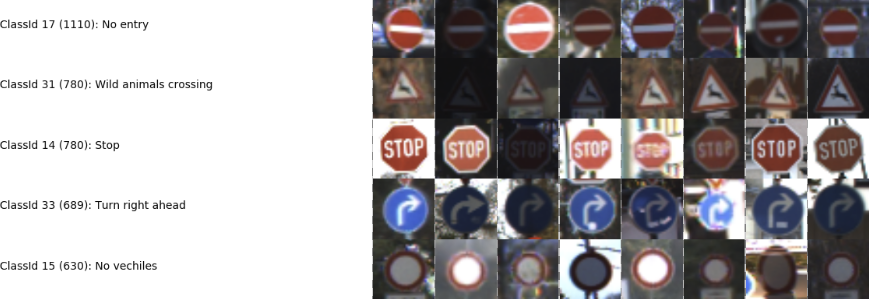
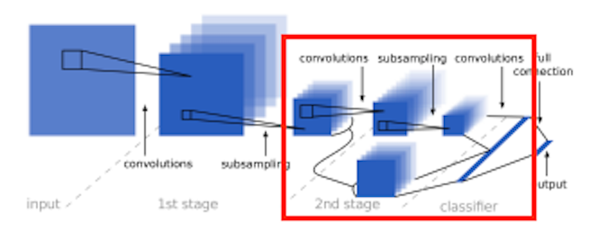
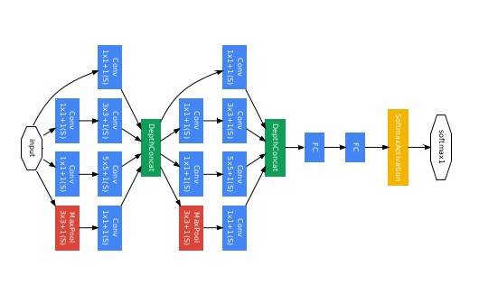
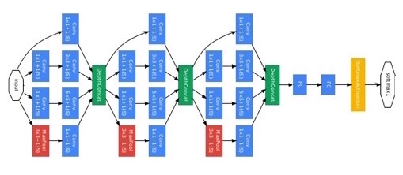

# SDC-P2
Udacity SDC Project 2: German Traffic Sign Recognition

SDC-P2 is a program written in Python in *Jupyter Notebook* form to recognize German traffic signs using a Convoluted Neural Networks (CNN) machine learning models.



We will be exploring three different CNN models in our project.

1. LeCun Multi-Scale Convolution Networks



2. Google's 2-Level Inception Modules



3. Google's 3-Level Inception Modules



## Installation

This project uses python 3.5.2. Clone the GitHub repository and use Pip to install jupyter and other dependencies listed, if not already done.

```
$ git clone https://github.com/diyjac/SDC-P2.git
$ pip install jupyter
$ pip install matplotlib
$ pip install numpy
$ pip install pickle
$ pip install sklearn
$ pip install cv2
$ pip install tensorflow
```

## Usage

SDC-P2 project results can be viewed by opening its jupyter notebook.

```
$ jupyter notebook P2.ipynb
```

## Contributing

No further updates nor contributions are requested.  This project is static.

## License

SDC-P2 results are released under the [MIT License](./LICENSE)

## NOTES
1. Please contact me if you wish to get the 2GB modelv3.ckpt session save files, or the 4GB modelv4.ckpt session files.  They are too large to include for github.
2. If you want to see previous attempts on candidate models 1, 2, and 4, please review the saved notebooks under ["attempts"](./attempts) folder for the previous *Jupyter Notebooks*.
3. The 5 new US traffic sign images are both under the "newimages" folder in github as well as in the new_us_traffic_signs.tar.gz archive.
4. Let me know if a stand-alone evaluator/recognizer is desirable.
5. Not all cells are executed for the final project Jupyter notebook.  This is because I had to re-start the notebook multiple times due to crashes in CUDA when tuning the parameters for the 3 inception modules model, candidate model 4.  They are not needed for the final project, but are included to show the iterative modeling and the success achieved during the 3 weeks of the project.  If necessary, I can remove the unexecuted cells.

Cheers,
John.
